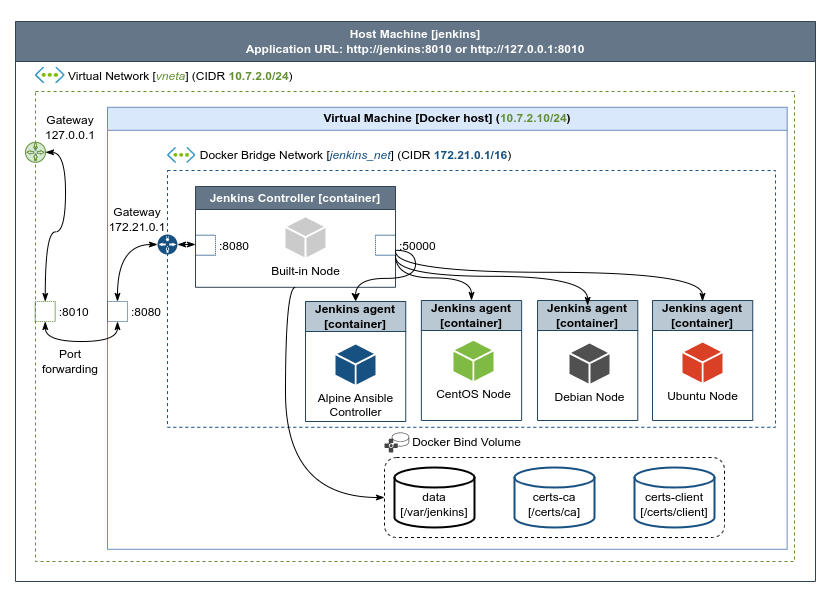

# cd-project-jenkins
CD Projects Jenkins provisioning

## Goal 
- Provision Jenkins in a Virtual Machine running on ubuntu Server 22.04 "jammy".
- The Jenkins instace must be running as a docker container.
- Set up four agent nodes running as docker containers too.
- All of the containers should be running on the same docker network.
- Use one of the node instances as Ansible controller.
  
# Architecture

This particular a dockerized Controller - Worker model. 

There is a Docker netkork where the jenkins controller and nodes run. Each node is a container set up as a permantent node.

The application data is saved in a docker volume to keep it persistent.

Each node has a different operating system:
- The Alpine node, functions as the Ansible controller.
- Whereas the CentOs, Debian and Ubuntu are the worker nodes.

  

# Installation instructions
1. Fork and Clone this repository onto the Virtual Machine running Ubuntu 22.04 "jammy".
2. Ensure the user account you are using has sudo privileges.
3. Execute the `install_jenkins.sh` shell script.
4. Configure the Jenkins Initial Credentials and plugins.
5. Add the SSH plugin.
6. Add the Alpine, CentOS, Debian and Ubuntu nodes accordingly.
7. Run the [ansible_hello.pipeline]() to the a simple test.

# Steps